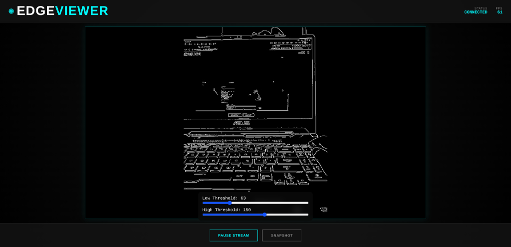
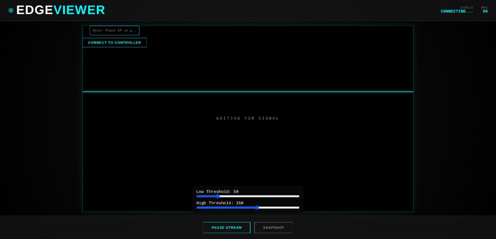
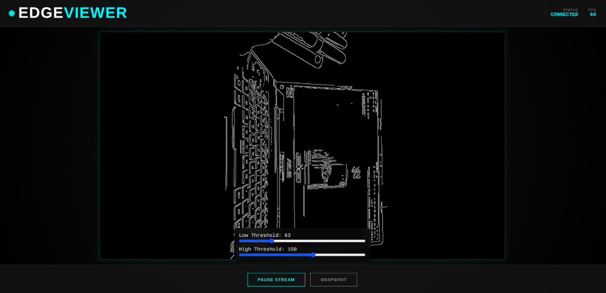
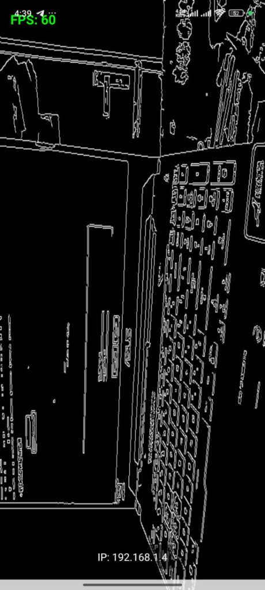
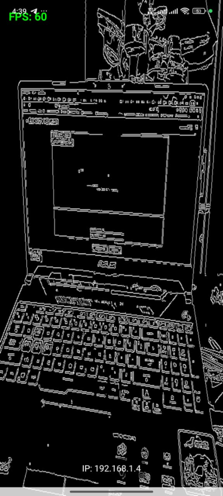
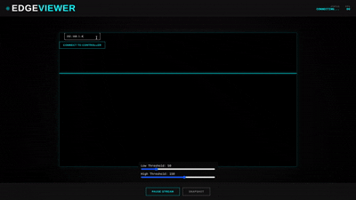

# Real-Time Edge Viewer

A high-performance Android application that captures camera frames, performs Canny Edge Detection using OpenCV (Native C++), and renders the result to the screen using OpenGL ES 2.0. It also includes a modern TypeScript-based web viewer interface.



## 🚀 Features

### Android App
- ✅ **CameraX Integration**: Efficient camera frame capture.
- ✅ **Native C++ Processing**: High-performance image processing using OpenCV 4.12.0.
- ✅ **Canny Edge Detection**: Real-time edge detection algorithm.
- ✅ **OpenGL ES 2.0 Rendering**: Low-latency rendering of processed frames via `GLSurfaceView`.
- ✅ **Real-Time Streaming**: MJPEG video stream (Port 8080).
- ✅ **Remote Control Server**: WebSocket server (Port 8081) for real-time control.

### Web Viewer
- ✅ **Modern UI**: Cyberpunk-themed interface built with Vite + TypeScript.
- ✅ **Real-Time FPS**: Synchronized FPS counter from the Android device.
- ✅ **Remote Control**: Adjust edge detection thresholds (Low/High) instantly.
- ✅ **Snapshot**: Capture high-quality frames to the Android Gallery remotely.
- ✅ **Responsive Design**: Works on desktop and mobile browsers.

## 📸 Screenshots

### Web Interface
| Connecting | Connected (Laptop) | Connected (Side View) |
|:---:|:---:|:---:|
|  |  |  |

### Android App
| Edge Detection View | UI Overlay |
|:---:|:---:|
|  |  |

### 🎥 Demo (GIFs)
| Web Viewer Demo | Android App Demo |
|:---:|:---:|
|  |  |

## ⚠️ Important: Deployment & Usage

**The Web Viewer is designed for LOCAL NETWORK use only.**

> [!IMPORTANT]
> The Vercel deployment (https://realtimeedgeviewer.vercel.app/) is **ONLY for viewing the UI design**. It **CANNOT** connect to your phone because cloud servers cannot reach your local network IP address.

### How to Run Properly

To get the full functionality (Video Stream + Controls + FPS), you must run the web viewer on the **same WiFi network** as your Android phone.

1.  **Clone & Install**:
    ```bash
    cd web-viewer
    npm install
    ```
2.  **Run Locally**:
    ```bash
    npm run dev
    ```
3.  **Connect**:
    - Open `http://localhost:5173`
    - Enter your Android phone's IP address (displayed on the app screen)
    - Click **CONNECT TO CONTROLLER**

## 🛠️ Setup & Build

### Prerequisites
- **Android Studio** (Koala or later)
- **Android NDK** (Version 27.0.12077973)
- **OpenCV Android SDK** (Version 4.12.0)
- **Node.js & npm** (for Web Viewer)

### Android Setup
1.  **OpenCV SDK**: Extract to `/home/{user}/Android/OpenCV-android-sdk`.
2.  **Open Project**: Open `RealTime-Edge-Viewer` in Android Studio.
3.  **Sync & Run**: Connect device and run. The app will install and ask for camera permissions.

### Web Viewer Setup
1.  Navigate to `web-viewer/`.
2.  Run `npm install`.
3.  Run `npm run dev` for local development.

## 🧠 Architecture

The project uses a hybrid architecture combining high-performance native code with modern web technologies.

### 1. Frame Capture & Processing (Android)
- **CameraX** captures frames in YUV format.
- **JNI Bridge** passes pointers to C++.
- **OpenCV (C++)** converts YUV → Gray → Canny Edge Detection.
- **OpenGL ES 2.0** renders the processed texture to the screen.

### 2. Streaming & Control (Networking)
- **MJPEG Streamer (Port 8080)**:
  - Compresses processed frames to JPEG.
  - Streams via HTTP for low-latency video.
- **WebSocket Server (Port 8081)**:
  - Handles bidirectional communication.
  - **In**: Threshold values, Snapshot commands.
  - **Out**: FPS data, Connection status.

### 3. Client-Side (TypeScript)
- **Vite + TypeScript**: Fast, type-safe development.
- **WebSocket Client**: Connects to the phone's WebSocket server.
- **MJPEG Player**: Standard `` tag updated via stream URL.

## Troubleshooting

- **Connection Failed**: Ensure both devices are on the **same WiFi**. Check if the phone's IP is correct.
-   **Camera Permission**: Grant camera permissions when prompted.
- **No Video**: Check camera permissions on Android.
- **Build Errors**: Verify NDK version (27.0.x) and OpenCV path in `CMakeLists.txt`.

## License

This project is licensed under the MIT License - see the [LICENSE](LICENSE) file for details.
